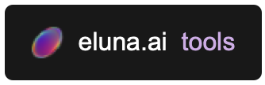
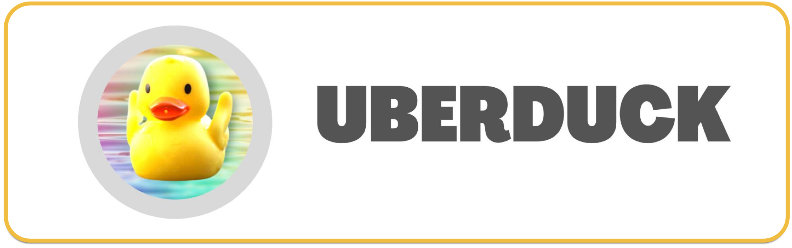

# Ai Voice Tutorial

## Pre-Setup
1. Install Anaconda

## So-Vits-SVC  

1. [Local Setup Instruction](https://www.youtube.com/watch?v=4DT92oHJ_p4)
2. [So-Vits-SVC: Local Training Tutorial (How to make your own model)](https://www.youtube.com/watch?v=MDCXJY2zAmE)
3. [Additional Links and Sample Content](https://www.youtube.com/watch?v=bNphqZZuqy8)

## Additional Ai Tools

https://www.eluna.ai/tools

#### SoftVC VITS Singing Voice Conversion Fork

https://github.com/voicepaw/so-vits-svc-fork

#### Audio Slicer

https://github.com/flutydeer/audio-slicer

#### Uber Duck

